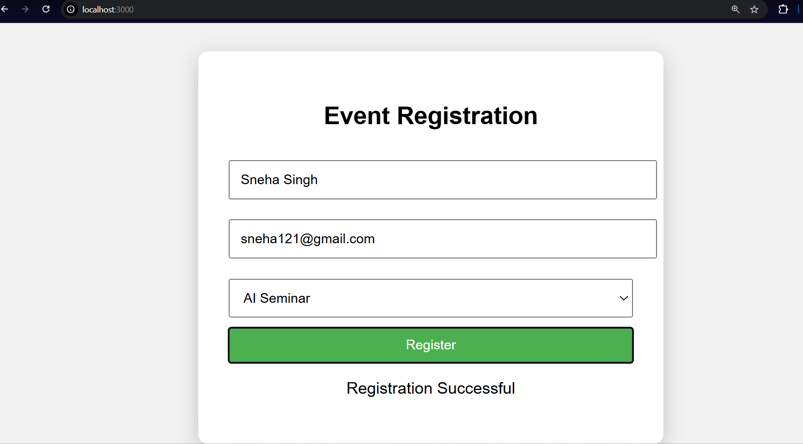
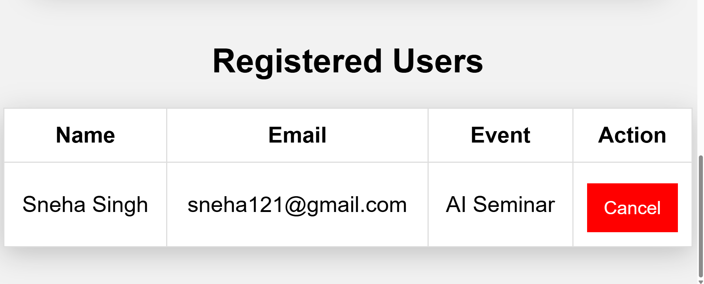

# 🎉 Event Registration System

## 📌 Description
This is a full-stack Event Registration System built using Node.js, Express, and MySQL. Users can register for events, view registrations, and manage event data.

## 🚀 Features
- User registration for events
- Store user data in database
- View all registered participants
- Cancel registration option
- Admin view for all entries

## 🛠️ Tech Stack
- Node.js
- Express.js
- MySQL
- HTML, CSS, JavaScript

## ▶️ How to Run

1. Install dependencies:
npm install

2. Start server:
node server.js

3. Open in browser:
http://localhost:3000

## 📂 Project Structure
- server.js
- public/index.html
- package.json

## 💡 Learning Outcome
- REST API development
- Database integration
- CRUD operations
- Backend logic building
## 📸 Project Preview

## Author
Siddhi Gandhi
